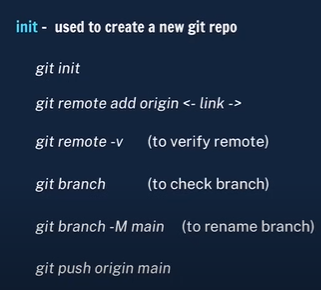

# Github-Commands
Every new laptop purchase?
<ol>
<li> Git software install https://git-scm.com/download/win</li>
<li> git config --global user.name "yourname"</li>
<li> git config --global user.email "youremail@gmail.com"</li>
</ol>

## Every new project?
<ol>
  <li> git init</li>
  <li> git remote add origin "remote url/path"</li>

</ol>

## Every new file added/change/delete?
<ol>
  <li> git add . </li>
  <li> git commit -m "initial commit"</li>
    <li> git branch -M main</li>
   <li> git remote add origin "remote url/path"</li>
  <li> git push origin main</li>
</ol>

Hello

<ol>
<h2>More commands</h2>
<li>status check: to check status</li>
<li>remote repo: git remote -v</li>
<li>change name: git branch -M main</li>
<li>new branch : git branch <main></li>
<li>current branch : git branch</li>
<li>switch branch  : git checkout <name></li>
<li>switch & create branch: git checkout -b <name></li>
<li>delete branch  : git branch -d <name></li>
<li></li>
<li></li>
<li></li>
<li></li>
<li></li>

</ol>